# Healthsites Entity Relationship Diagram

The diagram below summarizes the relationships between the Django models that
power the Healthsites data loading, community, OSM extension, and API
components.  It is meant as a high-level reference for onboarding or design
reviews; for field-level details see the individual model files inside the
Django apps.

```mermaid
erDiagram
    auth_user ||--|| social_users_profile : "extends"
    auth_user ||--|| social_users_gatheruser : "extends"
    auth_user ||--|| social_users_trusteduser : "extends"
    auth_user ||--o{ social_users_organisation : "organizer"
    auth_user ||--o{ localities_dataloaderpermission : "uploader"
    auth_user ||--o{ localities_dataloader : "author"
    auth_user ||--o{ localities_osm_extension_pendingupdate : "uploader"
    auth_user ||--o{ localities_osm_extension_pendingreview : "uploader"
    auth_user ||--o{ api_userapikey : "api keys"

    django_site ||--o{ social_users_organisation : "site"

    social_users_trusteduser ||--o{ social_users_organisationsupported : "membership"
    social_users_organisation ||--o{ social_users_organisationsupported : "supports"

    localities_country ||--o{ localities_country : "parent"

    localities_osm_extension_localityosmextension ||--|| localities_osm_extension_pendingupdate : "extension"
    localities_osm_extension_localityosmextension ||--o{ localities_osm_extension_tag : "tags"

    api_userapikey ||--o{ api_apikeyaccess : "requests"
    api_userapikey ||--o{ api_apikeyrequestlog : "logs"
    api_userapikey |o--o| api_apikeyenrollment : "enrollment"
```

## Reading tips

* The diagram includes `auth_user` and `django_site` so that the Django
  contrib models involved in the relationships are visible.
* `localities_country` inherits from the abstract `Administrative` model, so
  the self-reference on the diagram represents the `parent` ForeignKey defined
  in `Administrative`.
* Many-to-many relationships between Organisations and Trusted Users are shown
  explicitly through the `OrganisationSupported` join table so that the staff
  flag on the relationship is not lost.
* Only models that define database tables are included. Abstract helpers such
  as `SingletonModel` are intentionally omitted because they do not appear in
  the ERD.
